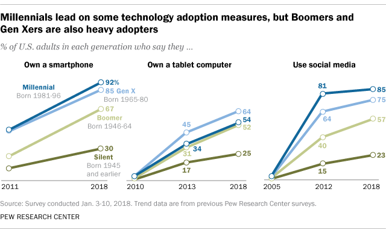
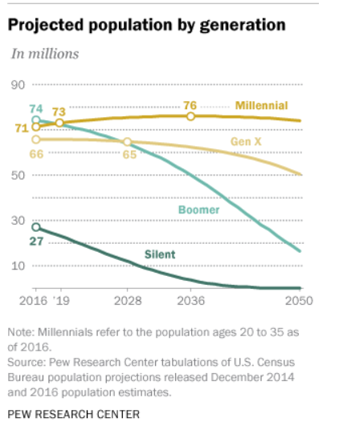
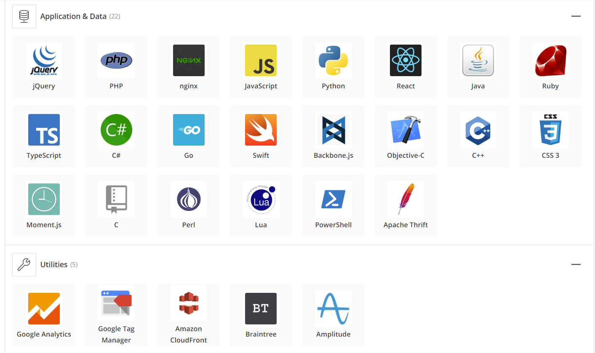
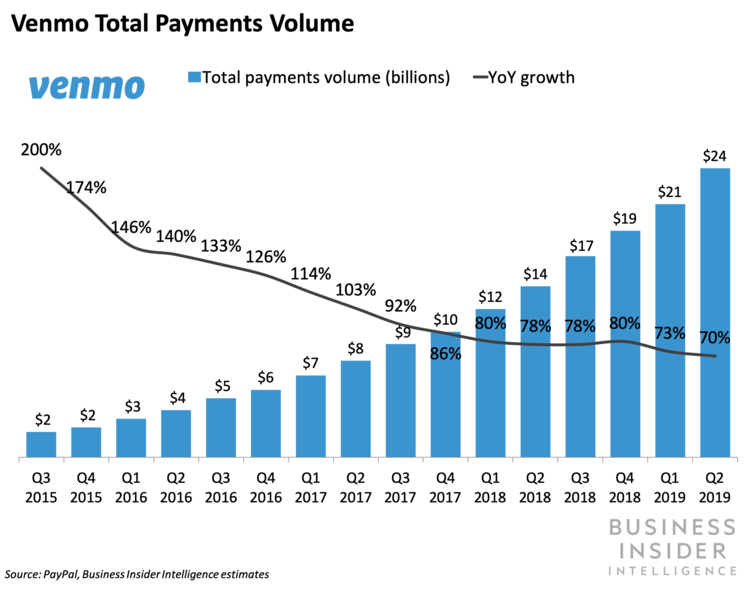
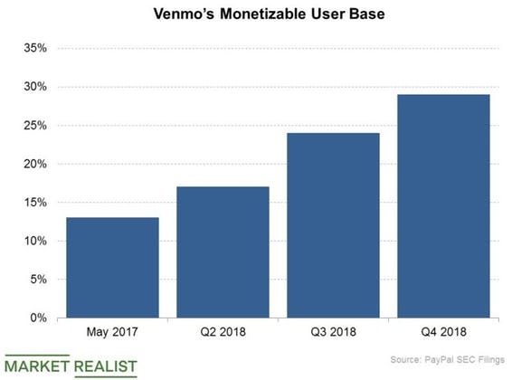
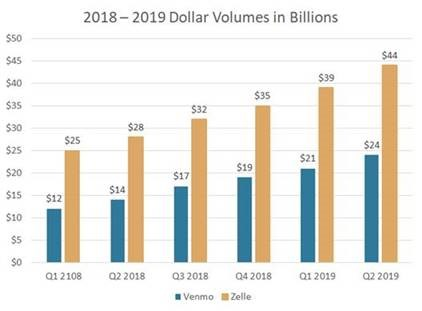
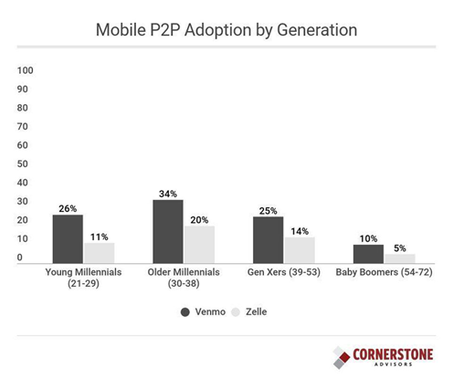

# VENMO – FINTECH CASE STUDY

## Overview and Origin
### Name of company: 

Venmo

### When was the company incorporated?
Venmo was founded in 2009. Following a few years in beta, Venmo was launched to the public in 2012.

### Who are the founders of the company?
Venmo was founded by Andrew Kortina and Iqram Magdon-Ismail, who met as freshman roommates at the University of Pennsylvania in 2001. Initially both Magdon-Ismail and Kortina majored in Computer Science but Kortina moved to a double major in Philosophy and Creative Writing. Magdon-Ismail and Kortina moved out together after college and continued to collaborate on business ideas including building websites for local restaurants, a website analytics tool called Swooge and a web-based music marketplace called Philafunk. Following this initial period after college, the pair became the first employees of a New York based dating site startup called iminlikewithyou.com, which had just come out of Y Combinator, but left after the company pivoted to gaming. At this stage their paths diverged slightly with Magdon-Ismail joining Ticketleap and Kortina moving to Betaworks to work on Bit.ly. 

### How did the idea for the company (or project) come about?
In 2009 Magdon-Ismail was thinking about leaving Ticketleap and wanted to collaborate again with Kortina on business ideas. At this time a mutual friend of theirs was opening a shop in Philadelphia and asked if they could assist with the technology aspect of the set up. They prototyped Point of Sale software to combine a laptop and magnetic credit card reader into a cash register. This experience got the pair interested in payments and gave them an insight into the issues with the current payments system. While attending a concert together they came up with the idea of buying and downloading  songs from the artist simply by sending the band a text message. They gave this idea the name Venmo, an amalgam of vendere, Latin for sell, and mo, short for mobile. This wireframe sketch shows the basic text message music store concept:

During a weekend working on this idea in New York, Magdon-Ismail who was visiting from Philadelphia, left his wallet behind and Kortina spotted him during his stay. To pay Kortina back Magdon-Ismail wrote him a check, a process which they found annoying to write and equally as cumbersome to deposit. They agreed that it would have probably been easier to use PayPal to facilitate the P2P payment, however niether of them used it and neither did any of their friends. The pair resolved to try and solve this problem. They built a prototype which used text messages (in a pivot from the music store concept) and a Google Voice account, to receive text messages formatted with an instruction “send $20 to Dave”. The system would then then send a notification to the payment recipient “John sent you $20”. The text message parser was written in Python as per the screen shot below:

The pivot from music to P2P is summarized in this slide from an early company presentation:

While iterating their prototype they added a note to the recipient messag to provide context about what the payment was for. The pair quickly realized that this stream of messages could provide rich information about what people were doing and who they were socializing with. Thinking that this social aspect could have wide appeal they added the ability to tag payment narrative messages with #p, which would add them to a public feed on Venmo.com.

### How is the company funded? How much funding have they received?

Kortina and Magdon-Ismail took their prototype to VCs to raise funding however the response was tepid, as whilst they had a vision and working proof of concept they were yet to build any user base. Despite this inital setback, the pair were able to leverage their network and secured two experienced entrepreneurs as advisers, Sam Lessin, who ran a startup called drop.io, and Chris Stanchak the CEO of Ticketleap. This involvement morphed into funding in December 2009 when Sam and his father, Bob, led the first angel round of financing which closed in 2010 raising $1.2M. Venmo then completed a Series A round in 2011 raising a further $7M. Several months after launching to the public in 2012, Venmo was acquired by Braintree for $26.2M. In 2013, PayPal (still part of eBay at this stage) acquired Braintree (including Venmo) for $800 million.

---
## Business Activities:

### What specific financial problem is the company or project trying to solve?
Venmo was born out of the frustration that the founders experienced when trying to make payments to each other and within their social circle. At the time users were restricted to payment methods like EFT (Electronic Funds Transfer), Swift and writing checks, methods that were replete with inefficiencies, high fees and unintuitive user experiences. The general philosophy behind the P2P Payment concept was that paying your friends should be as easy as sending them a text message. That is to say it should be mobile and frictionless. The most prevalent use case was to repay friends for split checks at a restaurant or a bar. Another major feature of Venmo is to capture the transaction flow and description messages, thereby providing info to the peer group about who is paying who for what. This feed adds a social element to Venmo which has been integral to its viral spread amongst Millennials.

### Who is the company's intended customer?  Is there any information about the market size of this set of customers? What solution does this company offer that their competitors do not or cannot offer? 

Venmo is aimed squarely at Millennials. Millennials are the first digital native generation and as such are early adopters of technology with 9 in 10 Millennials owning a smartphone. Millennials are also a social and open generation, with 85% using social media.

Millennials are projected to become the largest demographic in the United States this year as per the chart below. 

Whilst the P2P Payments sector has many players Venmo has been able to distinguish itself by incorporating a social dimension. When fist developing Venmo Kortina and Magdon-Ismail realized that the social feed presented rich information on a person’s social circle capturing who they hung out with and what they did together. Making this information shareable across one’s social group and beyond allows people to see who is doing what with whom giving it an almost voyeuristic aspect. This was no doubt key in its early success with Venmo spreading in its early stages largely by word of mouth. The term “I’ll Venmo you” has entered the lexicon of Millennials across the country.

It should be noted that whilst the social news feed element has been a key factor in Venmo’s success it can have unintended consequences and does introduce some privacy concerns. In 2018 researcher Hang Do Thi Duc analyzed 208 million pubic transactions records from Venmo allowing her to determine a significant amount about users lives. Her methodology and findings were published on the site [Public By Default](https://publicbydefault.fyi).

### Which technologies are they currently using, and how are they implementing them? 

The tech stack is a follows:
* jQuery - A JavaScript library.
* PHP- A general-purpose scripting language 
* Nginx - open source web server 
* JavaScript -, interpreted, object-oriented language 
* Python - an interpreted, high-level, general-purpose programming language.
* Java - class-based, object-oriented, language 
* Ruby – A dynamic, interpreted, open source programming language 
* React - A JavaScript library for building UIs
* TypeScript –A superset of JavaScript 
* C# -, general-purpose, object-oriented programming language built for .NET 
* Go - An open source programming language 
* Swift - An programming language for Cocoa / Cocoa Touch.
* Objective-C - The primary programming language for building software on OS X and iOS
* C++ - general-purpose programming language
* CSS - Cascading Style Sheets describes how HTML elements are displayed.
* Moment.js - JavaScript date library 
* C – Widely used programming language
* Perl  - Widely used programming language
* Lua - Embeddable scripting language
* PowerShell – Microsoft Command Line Interface 
* Apache Thrift - Software to create services across programming languages
---
## Landscape:
###  What domain of the financial industry is the company in?
P2P Payments.

###  What have been the major trends and innovations of this domain over the last 5-10 years?
The P2P Payments sector has exploded in the last decade with a proliferation of new P2P companies coupled with incumbent financial institutions providing more sophisticated and tailored service offerings. P2P Payment volumes have grown significantly over the past decade and continue to grow at a rapid pace. 2018 saw 128M P2P Payment transactions, up 32.2% from the prior year, with a Total Transaction Volume of $209.6B. 

Whilst disruptors like Venmo have significantly impacted the P2P Payments landscape it is important to note that to date Venmo has by and large been dependent on the existing payment infrastructure. Whilst Venmo users can make payments to each other, which flows through to their respective Venmo balances, for the majority of users they must ‘withdraw’ their money to their bank account before they can use it. As such the ACH Network (established in the 1960s and operated by the Federal Reserve and the Electronic Payment Network clearing house) has been a direct beneficiary of the success of P2P companies like Venmo. An interesting trend in ACH Payment volumes has been the growth in same day payments with significant growth of 137% in volume and 83% value in 2018 over the prior year. This growth is predominately due to the P2P Payments which tend to offer transfers to bank accounts either over 1 to 3 days or same day with the same day offering normally incurring a higher fee.   Venmo launched an Instant Transfers withdrawal feature in 2018, allowing users to withdraw their Venmo balance to their debit card within ~30 minutes and for a 1% fee (minimum $0.25 / maximum $10). The Instant Transfer feature was expanded to Bank Accounts in August 2019. Venmo has partnered with merchants such as Chipotle, Grubhub and Uber to offer Pay with Venmo allowing users to use Venmo to make purchases.  PayPal also allows users to fund PayPal transactions with their Venmo balance thereby vastly increasing the networks reach.

The launch of the Venmo Card (a debit card issued by Bancorp Bank on the MasterCard payment network) in 2018 marks an important development for Venmo. By linking the Venmo Card to a user’s balance, Venmo are allowing users to access their money at ATMs (up to $400 per day), in store and online without having to withdraw it first keeping them in the Venmo ecosystem longer. Whilst there are no signup or annual fees, Venmo will charge a $2.50 fee for withdrawals from some ATMs and $3 for over the counter withdrawals at a bank or financial institution. Other non-bank payments companies are offering their own card with the Apple Card launching in August 2019, as well as the PayPal Cash Card and the Square Cash Card. 

###  What are the other major companies in this domain?
The major participants in the P2P sector are PayPal, Zelle, Venmo, Square Cash, Google Wallet, PopMoney and Dwolla. Of these participants Venmo's main competitors are Zelle and Square Cash. 

Zelle was launched in response to the success of Venmo by several major US Banks (Ally Bank, Bank of America, Bank of the West, BB&T, BECU, Capital One, Citi, Fifth Third Bank, FirstBank, First Tech Federal Credit Union, Frost Bank, JP Morgan Chase, Morgan Stanley, PNC, USAA, U.S. Bank and Wells Fargo) in 2017. Zelle is very similar to Venmo in that it allows users to transfer money to a person through using either their email address or phone number. Zelle has the distinct advantage over Venmo, in that being offered by banks it is already bundled with customers' existing accounts and can be accessed through their current bank’s internet banking site or app. As of the start of 2019 Zelle has signed up 230 Banks to offer the service with 60 of those currently implementing it. 

Square was founded in 2009 by Jack Dorsey and Jim McKelvey to provide small businesses with a means to accept credit card payments. The company’s first product was the Square Reader which turned any smart phone into a merchant terminal via the phone's headphone jack. Square has expanded to offer financial and merchant services as well as mobile payments. Square Cash was launched in 2013 with very similar functionality to Venmo, allowing users to pay anyone via using their email address or phone number and funding the payment via a linked debit card. Square Cash is attractive to merchants as well, as it allows Square Cash transactions to be paid directly into their bank accounts, providing faster settlements over other payment networks.

---
## Results
###  What has been the business impact of this company so far?
Venmo has been a huge success since its launch. Having what amounts to a first mover advantage in the P2P Payments space Venmo was able to define the category and all entrants since that initial point have in essence followed its lead.  Coinciding with the rapid adoption of mobile and social technologies Venmo became a favorite app of the Millennial generation fitting into their lifestyle of being on modest incomes, living in share houses and socializing frequently with friends.  Venmo was at the vanguard of the FinTech industry and as such its rapid success has smoothed the way for the ascension of other disruptive fintech companies. 

###  What are some of the core metrics that companies in this domain use to measure success? How is your company performing, based on these metrics?
Total Payments Volume (TPV) is the main metric which is used to assess performance in the P2P Payments sector. Venmo has enjoyed significant growth in the last few years as can be seen in the following chart:

Beyond TPV, the amount of revenue generated is also a key measure of success. In Venmo’s early period the company was focused on growing the user base and as such monetization was not a priority. With the recent launch of Instant Transfers, the Venmo Card and Pay with Venmo revenue generation has started to increase. As of 2019 Venmo had 40 million active yearly users and the strategy is to convert free users to monetized users has produced good results over the last couple of years.

###  How is your company performing relative to competitors in the same domain?
Venmo’s main competitor in P2P Payments is Zelle. Given Zelle’s advantage of an embedded user base, it has quickly surpassed Venmo since launching. For Q2 2019 Zelle had a TPV of $44B against $24B for Venmo. Zelle’s growth is not occurring at the expense of Venmo however, with both growing strongly over the last 18 months. 

Despite its lead in TPV, Venmo continues to better Zelle for penetration in the key Millennial demographic.

With Venmo continuing to innovate to monetize its sizable user base, Zelle’s advantage in terms of pure TPV may be eroded as Venmo becomes more of a fully fledged payment network as opposed to a mere P2P payment provider. 

---
## Recommendations

###  If you were to advise the company, what products or services would you suggest they offer? (This could be something that a competitor offers, or use your imagination!) 
Venmo’s current challenge is how to monetize its sizeable user base. Most users still access the service for free by making P2P Payments and withdrawing the funds to a bank account via a no fee ACH 1 to 3 day transfer. Recent product offerings such as the Venmo Card, Pay with Venmo and Instant Transfers are aimed at generating revenue. 
In order to further deliver on the monetization strategy, I would recommend Venmo release a bill payment feature and a buy now pay later consumer credit service. 

###  Why do you think that offering this product or service would benefit the company?
Whilst P2P Payments have become much more intuitive and user friendly, paying bills is still a cumbersome and fragmented process. Mint Bills was a great service which allowed billers to push bill notifications to you via Mint where you could initiate payments straight from the platform. Mint retired this feature in June 2019 and I think Venmo could offer something similar with bills pushed to and payments initiated from the Venmo app. Bill payments represent significant payment volumes with 10 billion one-time bill payments made in 2016. Allowing users to receive and pay bills in the Venmo app would be a very convenient solution which would result in fewer bills falling overdue and less time spent organizing personal finances. As such Venmo could charge the billers and users a small fee to deliver the bill notification and facilitate the payment. Through PayPal and Braintree, Venmo has access to an extensive payment network integrated with thousands of merchants. This scale would allow Venmo to signup a large number of billers to the platform and build a very attractive product in a short amount of time.

The consumer credit segment is dominated by incumbent financial intuitions like banks and credit card providers. Given Venmo’s aggregation of alternative data and knowledge of their users' peer group there is scope for some innovative credit risk analysis to be utilized. As part of their partnership with merchants through the Pay with Venmo service, users could select a Pay with Venmo Credit feature which could make the payment on their behalf and aggregate all credit purchases into a single monthly repayment.

###  What technologies would this additional product or service utilize and why are they appropriate for your solution? 
Bill payment would utilize APIs to integrate Venmo with the merchant/utilities system to push bill information to the Venmo app, facilitate the payment and match a Venmo user’s payment to the bill record. Paper bills could also be printed with a Venmo QR code to allow users to scan the code and complete the payment via their Venmo app. 

Venmo could use machine learning models to determine a user’s probability of default and offer competitive interest rates and payment terms. Venmo could also partner with merchants to offer 0% APR promotional periods to certain users. The ability to assess each purchase separately whilst still being able to aggregate the outstanding balance could deliver a very versatile and convenient product to consumers.

---

## References

Baker, K., 2016. The Story of How Venmo Was Started [WWW Document]. The Hustle. URL https://thehustle.co/how-venmo-started (accessed 1.9.19).

Campbell, C., 2018. What Is Venmo? - NerdWallet [WWW Document]. NerdWallet. URL https://www.nerdwallet.com/blog/banking/what-is-venmo/ (accessed 1.9.19).

Origins of Venmo [WWW Document], n.d. . kortina.nyc. URL http://kortina.nyc/essays/origins-of-venmo/ (accessed 1.9.19).

StartupBootcamp, 2013. Iqram Magdon-Ismail (Venmo) — Startup Bootcamp 2013 [WWW Document]. YouTube. URL https://www.youtube.com/watch?v=aX7JCCCmLJw (accessed 1.9.19).

Team Venmo September 01, 2019, 2019. What is Venmo? [WWW Document]. Venmo. URL http://help.venmo.com/hc/en-us/articles/221011388-What-is-Venmo- (accessed 1.9.19).

Venmo Company Profile: Acquisition & Investors | PitchBook [WWW Document], n.d. . Venmo. URL https://pitchbook.com/profiles/company/51006-61 (accessed 1.9.19).

Prensky, Marc. (2001). Digital Natives, Digital Immigrants Part 1. On the Horizon. 9. 1-6. 10.1108/10748120110424816.
	
Cheslow, Daniella. "As Payments Go Social With Venmo, They’re Changing Personal Relationships." NPR.Org, 25 Feb. 2019, https://www.npr.org/2019/02/25/697090168/as-payments-go-social-with-venmo-theyre-changing-personal-relationships.

Fry, Richard. "Millennials Expected to Outnumber Boomers in 2019." Pew Research Center, 1 Mar. 2018, https://www.pewresearch.org/fact-tank/2018/03/01/millennials-overtake-baby-boomers/.

Nast, Condé. "I Scraped Millions of Venmo Payments. Your Data Is at Risk." WIRED, 1 Sept. 2019, https://www.wired.com/story/i-scraped-millions-of-venmo-payments-your-data-is-at-risk/.

PUBLIC BY DEFAULT - Venmo Stories of 2017. 1 Jan. 2001, https://publicbydefault.fyi.

"Venmo - Venmo Tech Stack." StackShare, https://stackshare.io/venmo/venmo. Accessed 9 Jan. 2019.

Yurieff, Kaya. "A Researcher Studied a Year of Public Venmo Transactions. Here’s What She Learned." CNNMoney, 17 July 2018, https://money.cnn.com/2018/07/17/technology/venmo-payments-public/index.html.

Chin, Monica. "Hallelujah, Grubhub Will Finally Split Your Check for You." Mashable, 17 Apr. 2018, https://mashable.com/2018/04/17/venmo-partners-with-grubhub/.

Fry, Richard. "Millennials Expected to Outnumber Boomers in 2019." Pew Research Center, 1 Mar. 2018, https://www.pewresearch.org/fact-tank/2018/03/01/millennials-overtake-baby-boomers/.

Global P2P Payments Market Size, Statistics, Growth, Opportunities to 2025 Industry Analysis by Key-Players, Types, Transaction-Mode, Application - Reuters. 2 Apr. 2019, http://www.reuters.com/brandfeatures/venture-capital/article?id=95546.

Grotta, Sarah. "Round Up of Recent Person-to-Person Payment Data | PaymentsJournal." PaymentsJournal, 25 Apr. 2019, https://www.paymentsjournal.com/round-up-of-recent-person-to-person-payment-data/.

Hamilton, Cameron. "Peer to Peer Payment Trends - Credera." Credera, 9 Aug. 2018, https://www.credera.com/blog/management-consulting/peer-to-peer-payment-trends/.

Jiang, Jingjing. "Millennials Stand out for Their Technology Use." Pew Research Center, 2 May 2018, https://www.pewresearch.org/fact-tank/2018/05/02/millennials-stand-out-for-their-technology-use-but-older-generations-also-embrace-digital-life/.

"Nacha News ACH Network Moves 23 Billion Payments and $51 Trillion in 2018 Looking for More Information on Nacha? Follow Us on Social Media." Nacha, https://www.nacha.org/news/ach-network-moves-23-billion-payments-and-51-trillion-2018. Accessed 9 Jan. 2019.

Newlove, Clark. "The Rise of Peer-to-Peer (P2P) Payments on Mobile — What Makes It Such a Crucial Feature?" N26 US Magazine, 10 Aug. 2018, https://medium.com/n26-us/the-rise-of-peer-to-peer-p2p-payments-on-mobile-what-makes-it-such-a-crucial-feature-921355ba4ad8.

Perez, Sarah. "Venmo Launches Instant Transfers to Bank Accounts – TechCrunch." TechCrunch, http://social.techcrunch.com/2019/08/12/venmo-launches-instant-transfers-to-bank-accounts/. Accessed 9 Jan. 2019.

---. "Venmo Officially Launches Its Own MasterCard-Branded Debit Card – TechCrunch." TechCrunch, http://social.techcrunch.com/2018/06/25/venmo-officially-launches-its-own-mastercard-branded-debit-card/. Accessed 9 Jan. 2019.

Pymnts. "The History Of Square | PYMNTS.Com." PYMNTS.Com, 17 Apr. 2017, https://www.pymnts.com/mpos-tracker/2017/square-jack-dorsey-cash-capital-first-data-vantiv-paypal-uk-apple-pay-debit-pymnts-mpos-tracker-mobile-payments-mobile-point-of-sale/.

Shevlin, Ron. "Venmo Versus Zelle: Who’s Winning The P2P Payments War?" Forbes, 11 Feb. 2019, https://www.forbes.com/sites/ronshevlin/2019/02/11/venmo-versus-zelle/.

---. "Venmo Versus Zelle: Who’s Winning The P2P Payments War?" Forbes, 11 Feb. 2019, https://www.forbes.com/sites/ronshevlin/2019/02/11/venmo-versus-zelle/.

"Square Cash Is Open for Business." Square, https://squareup.com/us/en/press/introducing-cashtags. Accessed 9 Jan. 2019.

Team Venmo September 01, 2019. "Fees for the Venmo Card." Venmo, 1 Sept. 2019, http://help.venmo.com/hc/en-us/articles/360000998367-Fees-for-the-Venmo-Card.

---. "Instant Transfers FAQ." Venmo, 1 Sept. 2019, http://help.venmo.com/hc/en-us/articles/115015844068-Instant-Transfers-FAQ.

"What Is ACH? Join Our Team." Nacha, https://www.nacha.org/content/what-is-ach. Accessed 9 Jan. 2019. 

Allison, Chelsea. "How Venmo Does P2P without Fees." Fin | Insights on the Future of Finance from Plaid, 1 Mar. 2019, https://fin.plaid.com/articles/how-venmo-does-p2p-without-fees/.

---. "The Primary Players in Payments Processing." Fin | Insights on the Future of Finance from Plaid, 1 Mar. 2019, https://fin.plaid.com/articles/major-players-in-payment-processing/.

"Early Warning Announces ZelleSM Network." Early Warning, 24 Oct. 2016, https://www.earlywarning.com/press-release/early-warning-announces-zellesm-network.

Grotta, Sarah. "Venmo and Zelle Report P2P Volume Growth | PaymentsJournal." PaymentsJournal, 26 July 2019, https://www.paymentsjournal.com/venmo-and-zelle-report-p2p-volume-growth/.

Gupta, Neha. PayPal Is Exploring a New Way to Monetize Venmo - Market Realist. 16 May 2019, https://marketrealist.com/2019/05/paypal-is-exploring-a-new-way-to-monetize-venmo/.

Keyes, Daniel. "Venmo’s Payments Volume Is Thriving, but Its Monetization Efforts Are Still Developing." BI, 26 July 2019, https://www.businessinsider.com/venmo-played-key-role-growing-paypals-tpv-2019-7.

"Press." THIS IS HOW MONEY MOVES, 23 July 2019, https://www.zellepay.com/press-releases/zelle-announces-44-billion-sent-171-million-transactions-q2-2019.

Pymnts. "As P2P Payments Grows, Challenges Loom | PYMNTS.Com." PYMNTS.Com, 13 May 2019, https://www.pymnts.com/digital-payments/2019/zelle-venmo-p2p-payment-services-data-privacy/.

Roller, Emma. "The Quintessential App for the Urban Professional Twentysomething." Slate, 5 Aug. 2013, https://slate.com/technology/2013/08/venmo-review-the-wallet-app-is-light-years-ahead-of-paypal.html.

Rosenbaum, Eric. "Venmo Has Digital User Base Putting Heat on Square and Banks, but No Plan to Profit from It." CNBC, 25 Apr. 2019, https://www.cnbc.com/2019/04/25/venmo-discloses-huge-digital-user-base-but-no-plan-to-profit-from-it.html.

Shevlin, Ron. "Venmo Versus Zelle: Who’s Winning The P2P Payments War?" Forbes, 11 Feb. 2019, https://www.forbes.com/sites/ronshevlin/2019/02/11/venmo-versus-zelle/. 

 

